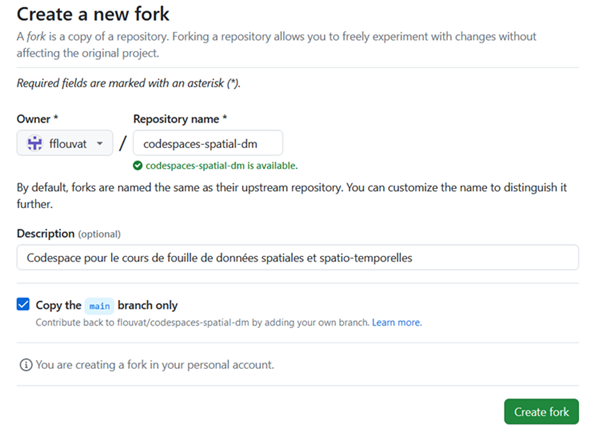
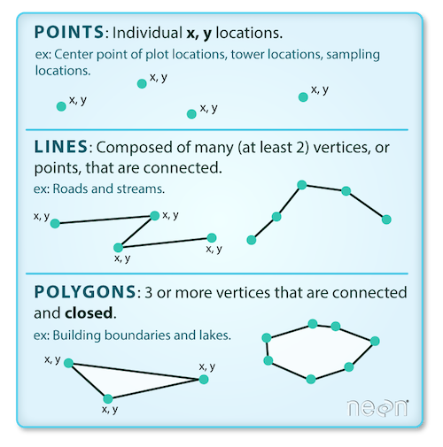

# TD 1 - Manipuler des données géographiques

## Préparation de l'environnement de développement

Dans le cadre de ce cours, nous allons utiliser différents outils de développement pour mettre en pratique les principales notions de la fouille de données spatiales. Ces outils sont [Python3](https://www.python.org/), [Anaconda](https://www.anaconda.com/) et [Jupyter Notebook](https://jupyter.org/). Nous utiliserons aussi différentes bibliothèques telles que [Gdal](https://gdal.org/index.html), [GeoPandas](https://geopandas.org/en/stable/), [rasterio](https://rasterio.readthedocs.io/en/stable/), ou [Scikit-learn](https://scikit-learn.org/stable/). 
Afin d'éviter d'avoir à installer ces différents outils sur votre machine, nous allons utiliser GitHub, et plus particulièrement les [GitHub Codespaces](https://github.com/features/codespaces) pour coder en ligne. 

Vous devez tout d'abord cloner le dépôt (_repo_ dans la terminologie git) `flouvat/codespaces-spatial-dm`. Il contient les données géographiques utilisées dans le cours et divers fichiers de configuration. Pour cela, il faut suivre les étapes suivantes:
- Dans votre espace GitHub, recherchez le dépôt  `flouvat/codespaces-spatial-dm` et ouvrez-le.
- Pour le cloner dans votre compte, il suffit de cliquer sur le bouton `Fork` et de valider les paramètres en cliquant sur le bouton `Create fork`.

L'environnement de développement en ligne de GitHub s'appelle [Codespaces](https://docs.github.com/fr/codespaces). Pour l'utiliser, il vous suffit de cliquer sur le bouton `<> Code`, puis de sélectionner l'onglet `Codespaces` et de créer un codespace sur le main. L’initialisation du codespace prend un peu de temps car elle installe certaines bibliothèques Python (p.ex. `matplotlib`, `numpy` et `pandas`).  
Un nouvel onglet s'ouvrira alors, et vous pourrez commencez à configurer votre environnement permettant de traiter des données géographiques.

Dans le terminal de Codespace, vous devez ensuite installer toutes les bibliothèques nécessaires en utilisant la commande `conda env create -f environment.yml`. Elle permet de créer un environnement virtuel, appelé `geopy`, avec les librairies nécessaires installées. Si la commande n'est pas reconnue, ouvrez un autre terminal (menu déroulant  ) et relancez la. La procédure prend un peu de temps (5 minutes environ). Attention, il faudra donc ensuite utiliser cet environnement lorsque vous exécuterez votre code dans Jupyter Notebook. 

Pour tester votre installation, vous pouvez aller dans le répertoire `\jupyter`, ouvrir le fichier `test.ipynb`, et exécuter le code Python inclut à l'intérieur. Si vous l’exécutez sans utiliser l'environnement virtuel `geopy`, vous obtiendrez une erreur `ModuleNotFound` car les bibliothèques utilisées dans le code ne sont pas accessibles. Pour utiliser `geopy`, il vous faut utiliser le bon "noyau Python" pour lancer le code. Ce noyau peut être sélectionné en cliquant sur le bouton  , puis en cliquant `Environnements Python` > `geopy`. Le code vous affichera alors un simple avertissement concernant `ResamplingOperation`. Une fois cela fait, vous pouvez exécuter le code de test.

## Les principaux types des données géographiques
Les données spatiales (ou données "géospatiales" ou encore "géographiques") sont des données contenant des informations de localisation.

Ces données  se présentent principalement sous deux formes :
- les données vectoriels ou `shape files`
- les données `raster`

### Les données vectorielles ("shapefiles")

Les données vectorielles s'attachent à représenter des formes (des objets géométriques) et à les positionner dans un système de coordonnées. Elles correspondent donc simplement à une collection de coordonnées à deux dimensions `(x,y)` ou a trois dimensions `(x,y,z)`, appelées "sommets". Ces sommets sont utilisés pour définir les objets suivants :
- `Point` : un seul point (p.ex. l'emplacement d'une personne)
- `Ligne` : deux ou plusieurs points connectés (p.ex. une route)
- `Polygone` : trois points ou plus connectés et fermés (p.ex. un bâtiment,  un lac ou la frontière d'un pays)

Comme illustré ci-dessous, ces objets peuvent être combinées pour aboutir à des données plus complexes telles que des `multi-points`, `multi-lignes`, `multi-polygones` ou `collections géométriques`.

### Les données rasters

Contrairement aux données vectorielles, les données raster correspondent à une matrice de valeurs de `pixels` (également appelées "cells"). Chaque pixel représente une petite zone et contient une valeur numérique.

Les données raster sont des images pour lesquelles chaque pixel représente une région spatiale. On parle de `résolution d’un raster` pour expliciter les dimensions de la zone (un carré) représenté par chaque pixel de l'image. Un raster de résolution de 1 mètre signifie que chaque pixel représente une zone de 1 m x 1 m au sol. On parle de "haute résolution" lorsque la valeur associée à la résolution est faible. Per exemple, une résolution de 1 mètre est supérieure à une résolution de 8 mètres, comme l'illustre l'image ci-dessous.

Les données raster sont utilisées dans différents contexte. Par exemple, les images satellitaires sont des raster, tout comme les Modèle Numérique de Terrain (MNT, i.e. Digital Elevation Model ou DEM en anglais). Les données raster peuvent issues de télédétection ("remote sensing"), i.e. d’instruments permettant d’acquérir à distance des informations sur un objet géographique. Typiquement, ces rasters sont capturés par des satellites, des avions ou des drones. 

Comme expliqué dans la documentation de [ArcGIS](https://pro.arcgis.com/fr/pro-app/latest/help/data/imagery/raster-bands-pro-.htm), certaines de ces images peuvent être composées d'une bande ou couche (i.e. mesurer une seule caractéristique), alors que d'autres peuvent être composées de plusieurs bandes (i.e. mesurer plusieurs caractéristiques). On parle alors d'`images multi-bandes`. Dans ce cas, chaque pixel est associé à plusieurs valeurs (autant que de bandes). Chaque bande correspond ainsi à une matrice de valeurs. Une bande représente une partie du spectre électromagnétique détecté par un capteur (p.ex. rouge, vert, bleu, proche infrarouge ou ultraviolet). Par exemple, les images Landsat-9 comportent 11 bandes différentes.

## Manipuler des données vectorielles

parler des formats shapefiles (geopandas,shapely) et geogson

### Lire des données vectorielles

### Créer des données vectorielles

## Manipuler des rasters

Comme pour les données vectorielles, il existe différents formats de fichiers pour stocker les données raster. Le plus courant est `GeoTIFF` ( .tif), qui est essentiellement un fichier image contenant des métadonnées de géoréférencement. Le package de base pour travailler avec des données raster en Python est rasterio .

## Travailler avec les systèmes de coordonnées (CRS)