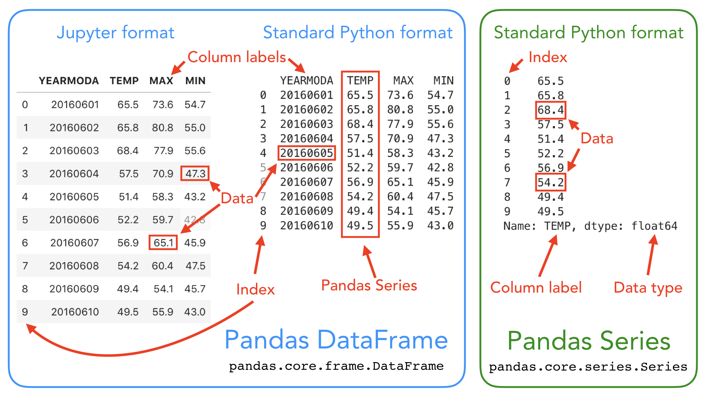

# TD 1 - Manipuler des données géographiques


## Préparation de l'environnement de développement

Dans le cadre de ce cours, nous allons utiliser différents outils de développement pour mettre en pratique les principales notions de la fouille de données spatiales. Ces outils sont [Python3](https://www.python.org/), [Anaconda](https://www.anaconda.com/) et [Jupyter Notebook](https://jupyter.org/). Nous utiliserons aussi différentes bibliothèques telles que [Gdal](https://gdal.org/index.html), [GeoPandas](https://geopandas.org/en/stable/), [rasterio](https://rasterio.readthedocs.io/en/stable/), ou [Scikit-learn](https://scikit-learn.org/stable/). 
Afin d'éviter d'avoir à installer ces différents outils sur votre machine, nous allons utiliser GitHub, et plus particulièrement les [GitHub Codespaces](https://github.com/features/codespaces) pour coder en ligne. 

Vous devez tout d'abord cloner le dépôt (_repo_ dans la terminologie git) `flouvat/codespaces-spatial-dm`. Il contient les données géographiques utilisées dans le cours et divers fichiers de configuration. Pour cela, il faut suivre les étapes suivantes:
- Dans votre espace GitHub, recherchez le dépôt  `flouvat/codespaces-spatial-dm` et ouvrez-le.
- Pour le cloner dans votre compte, il suffit de cliquer sur le bouton `Fork` et de valider les paramètres en cliquant sur le bouton `Create fork`.


L'environnement de développement en ligne de GitHub s'appelle [Codespaces](https://docs.github.com/fr/codespaces). Pour l'utiliser, il vous suffit de cliquer sur le bouton `<> Code`, puis de sélectionner l'onglet `Codespaces` et de créer un codespace sur le main. L’initialisation du codespace prend un peu de temps car elle installe certaines bibliothèques Python (p.ex. `matplotlib`, `numpy` et `pandas`).  
Un nouvel onglet s'ouvrira alors, et vous pourrez commencez à configurer votre environnement permettant de traiter des données géographiques.


Dans le terminal de Codespace, vous devez ensuite installer toutes les bibliothèques nécessaires en utilisant la commande `conda env create -f environment.yml`. Elle permet de créer un environnement virtuel, appelé `geopy`, avec les librairies nécessaires installées. Si la commande n'est pas reconnue, ouvrez un autre terminal (menu déroulant  ) et relancez la. La procédure prend un peu de temps (5 minutes environ). Attention, il faudra donc ensuite utiliser cet environnement lorsque vous exécuterez votre code dans Jupyter Notebook. 

Pour tester votre installation, vous pouvez aller dans le répertoire `\jupyter`, ouvrir le fichier `test.ipynb`, et exécuter le code Python inclut à l'intérieur. Si vous l’exécutez sans utiliser l'environnement virtuel `geopy`, vous obtiendrez une erreur `ModuleNotFound` car les bibliothèques utilisées dans le code ne sont pas accessibles. Pour utiliser `geopy`, il vous faut utiliser le bon "noyau Python" pour lancer le code. Ce noyau peut être sélectionné en cliquant sur le bouton  , puis en cliquant `Environnements Python` > `geopy`. Le code vous affichera alors un simple avertissement concernant `ResamplingOperation`. Une fois cela fait, vous pouvez exécuter le code de test.

## Les principaux types des données géographiques
Les données spatiales (ou données "géospatiales" ou encore "géographiques") sont des données contenant des informations de localisation.

Ces données  se présentent principalement sous deux formes :
- les données vectorielles 
- les données `raster`

### Les données vectorielles

Les données vectorielles s'attachent à représenter des formes (des objets géométriques) et à leur positionnement dans un système de coordonnées. Elles correspondent donc simplement à une collection de coordonnées à deux dimensions `(x,y)` ou a trois dimensions `(x,y,z)`, appelées "sommets". Ces sommets sont utilisés pour définir les objets suivants :
- `Point` : un seul point (p.ex. l'emplacement d'une personne)
- `Ligne` : deux ou plusieurs points connectés (p.ex. une route)
- `Polygone` : trois points ou plus connectés et fermés (p.ex. un bâtiment,  un lac ou la frontière d'un pays)


Comme illustré ci-dessous, ces objets peuvent être combinés pour aboutir à des données plus complexes telles que des `multi-points`, `multi-lignes`, `multi-polygones` ou des `collections géométriques`.


### Les données rasters

Contrairement aux données vectorielles, les données `raster` correspondent à une `matrice` de valeurs de `pixels` (également appelées "cells"). Chaque pixel représente une petite zone et contient une valeur numérique.


Les données raster sont des images pour lesquelles chaque pixel représente une région spatiale. On parle de `résolution d’un raster` pour expliciter les dimensions de la zone (un carré) représenté par chaque pixel de l'image. Un raster de résolution de 1 mètre signifie que chaque pixel représente une zone de 1 m x 1 m au sol. On parle de "haute résolution" lorsque la valeur associée à la résolution est faible. Per exemple, une résolution de 1 mètre est supérieure à une résolution de 8 mètres, comme l'illustre l'image ci-dessous.


Les données raster sont utilisées dans différents contextes. Par exemple, les images satellitaires sont des raster, tout comme les Modèle Numérique de Terrain (MNT, i.e. Digital Elevation Model ou DEM en anglais). Les données raster peuvent être issues de télédétection ("remote sensing"), i.e. d’instruments permettant d’acquérir à distance des informations sur un objet géographique. Souvent, ces rasters sont capturés par des satellites, des avions ou des drones. 

Comme expliqué dans la documentation de [ArcGIS](https://pro.arcgis.com/fr/pro-app/latest/help/data/imagery/raster-bands-pro-.htm), certaines de ces images peuvent être composées d'une bande ou couche (i.e. mesurer une seule caractéristique), alors que d'autres peuvent être composées de plusieurs bandes (i.e. mesurer plusieurs caractéristiques). On parle alors d'`images multi-bandes`. Dans ce cas, chaque pixel est associé à plusieurs valeurs (autant que de bandes). Chaque bande correspond ainsi à une matrice de valeurs. Une bande représente une partie du spectre électromagnétique détecté par un capteur (p.ex. rouge, vert, bleu, proche infrarouge ou ultraviolet). Par exemple, les images Landsat-9 comportent 11 bandes différentes.


Le nombre et le type de bandes capturées par les différents capteurs peuvent beaucoup varier. Ces informations sont importantes, et déterminent souvent le choix du capteur (p.ex. du satellite d'acquisition). En effet,  certaines bandes sont plus adaptées pour observer certains types d'objets (p.ex. le proche infra-rouge pour la végétation, l'ultraviolet pour les objets sous la surface de l'eau, ou le bleu pour les bâtiments). D'ailleurs, les géomaticiens ont défini un grand nombre d'indices basés sur une combinaison de bandes afin de mieux identifier et quantifier certains objets. Un exemple classique est le NDVI ("Normalized Difference Vegetative Index") permettant d'étudier la couverture végétale. La  [base de données IDB](https://www.indexdatabase.de/) ("Index DataBase") recense les différents capteurs existants, leurs caractéristiques et les indices calculables à partir de ceux-ci.


### Les systèmes de coordonnées de référence (CRS)

Un `système de coordonnées de référence` ("Coordinate Reference System" ou CRS) est un élément clé de l'information géographique. Un CRS précise comment les coordonnées ou les géométries sont liées aux lieux sur Terre. Sans le CRS, les données géographiques sont simplement une collection de coordonnées dans un espace arbitraire. Cette information appartient aux `métadonnées`, tout comme l'horodatage de création des données.

Un CRS est composé de trois éléments:
- le `datum`  est un modèle de la taille et de la forme de la Terre (p.ex. ellipsoïde ou géoïde). Il indique aussi l'origine du système de coordonnées et son orientation par rapport à la surface de la terre. L'un des systèmes de référence les plus couramment utilisés est le système géodésique mondial (`WGS84`).
- la `projection cartographique` définit la transformation mathématique utilisée pour projeter la surface de la Terre sur un plan bidimensionnel. 
- des paramètres supplémentaires telles que le méridien central, le parallèle standard et le facteur d'échelle.


La projection cartographique est une transformation particulièrement complexe qui engendre des [approximations](https://www.axismaps.com/guide/map-projections). Par conséquent, une projection doit être choisie en fonction du but d'utilisation, afin de préserver les aspects spécifiques de la carte qui sont les plus importants pour l'utilisateur, comme par exemple :
- la projection `Mercator` pour préserver les angles (donc les formes) ;
- les projections `Mollweide` ou `Albers equal area` pour préserver les surfaces ;
- la projection `Azimuthal equidistant` pour préserver les distances au centre de la projection.


**A noter que ces distorsions restent minimes à une petite échelle (locale).**

## Manipuler des données vectorielles en Python


Les données vectorielles sont classiquement stockée dans différents types de fichiers tels que:
- des fichiers textes (p.ex. CSV)
- des fichiers `shapefiles`
- des fichiers `geojson`
- des fichiers `KML`

Ces fichiers peuvent être lus en Python grâce à des bibliothèques telles que [Shapely](https://shapely.readthedocs.io/en/latest/) ou [GeoPandas](https://geopandas.org/en/stable/). Elles permettent de générer des objets géométriques Python, qui peuvent ensuite être traités, fusionnés avec d'autres données, et analysés. Ces bibliothèques intègrent de nombreuses fonctionnalités utiles que vous pouvez par exemple utiliser telles que :
- Créer une ligne ou un polygone à partir d'une collection de `Point`
- Calculer les surfaces/longueurs/limites, etc. 
- Effectuer des opérations géométriques telles que l'union, la différence, la distance, etc. 
- Effectuer des requêtes spatiales entre les objets telles que l'intersection, l'inclusion, la tangence, le croisement, etc. 

Elles sont sont très importantes dans le cadre de la préparation des données avant analyse ou apprentissage.

### Représenter des objets géométriques avec Shapely

Comme illustré dans les figures précédentes, les objets géométriques les plus fondamentaux dans `Shapely` sont `Point`, `LineString` et `Polygon`. 

#### Créer et manipuler des points

Créer un objet `Point` est très simple. Il suffit de passer en paramètre du constructeur les coordonnées `x` et `y` de l'objet (et éventuellement la coordonnée `z`). Vous pouvez par exemple tester le code suivant dans votre interface `Jupyter Notebook` sur `Codespace`. Pour cela, vous allez créer un nouveau fichier `readVectorData.ipynb` dans le répertoire `\jupyter`.
*Pensez à réutiliser toujours le même Codespace (vous pouvez même le nommer) avec l'environnement `geopy` afin d'éviter de devoir tout réinstaller à chaque fois.*

```python
# Import necessary geometric objects from shapely module
from shapely.geometry import Point, LineString, Polygon

# Create Point geometric object(s) with coordinates
point1 = Point(2.2, 4.2)
point2 = Point(7.2, -25.1)
point3 = Point(9.26, -2.456)

point3D = Point(9.26, -2.456, 0.57)

# What is the type of the point?
point_type = type(point1)

# Print point information
print(point1)

print(point3D)

print(type(point1))
```

La classe `Point` contient un certain nombre de méthodes et attributs permettant par exemple d'accéder aux coordonnées (attribut `coords`), à son abscisse (attribut `x`), à son ordonnée (attribut `y`) ou de calculer une distance à un autre point (méthode `distance(Point)`). A noter que le type de `coords` est `CoordinateSequence` et non un tableau de valeur. Pour obtenir ce tableau avec les coordonnées, il faut passer par l'attribut `xy` de `CoordinateSequence`, qui est un tableau `numpy` de nombres réels double précision (`double`). Le code suivant illustre cela. Pour le tester, il vous faut ajoute rune cellule de code  dans votre fichier `readVectorData.ipynb`,  copier le texte suivant et l'exécuter.

```python
# Get only x coordinates of Point1
x = point1.x
print(x)

# Get only y coordinates of Point1
y = point1.y
print(y)

# Get x and y coordinates
point_coords = point1.coords
print(type(point_coords))

xy = point_coords.xy
print(xy)
```

#### Créer et manipuler des lignes

La création d'un objet `LineString` est assez similaire à la façon dont un objet `Point` est créé. Toutefois, au lieu d'utiliser une seule coordonnée, nous allons utiliser une liste de coordonnées ou une liste de `Point`, comme le montre le code suivant. Tout comme précédemment, cette classe contient des attributs et méthodes pour accéder à différentes informations de l'objet, comme ses coordonnées (attribut `xy`), sa longueur (attribut `length`), son centroïde (attribut `centroid`). Le code suivant illustre cela. Vous pouvez le tester dans un nouveau bloque de code de `readVectorData.ipynb`.

```python
# Create a LineString from our Point objects
line = LineString([point1, point2, point3])
print(line)
print( type(line) )

# It is also possible to use coordinate tuples having the same outcome
line2 = LineString([(2.2, 4.2), (7.2, -25.1), (9.26, -2.456)])
print(line2)

# Get x and y coordinates of the line (an array of array of double, where line.xy[0] correspond to abscisses and line.xy[0] to ordinates)
lxy = line.xy
print(lxy)

# Extract x coordinates
line_x = lxy[0]
print(line_x)

# Extract y coordinates 
line_y = line.xy[1]
print(line_y)

# Get the length of the line
l_length = line.length
print("Length of our line: {0:.2f}".format(l_length))

# Get the centroid of the line
l_centroid = line.centroid
print("Centroid of our line: ", l_centroid)

# What type is the centroid? A point
centroid_type = type(l_centroid)
print("Type of the centroid:", centroid_type)
```

Une opération géospatiale typique consiste à voir si une géométrie en croise ou en touche une autre. Pour faire cela avec `Shapely`, il suffit d'utiliser l'une des méthodes suivantes: 
- [intersects()](https://shapely.readthedocs.io/en/stable/manual.html#object.intersects) qui retourne vrai si la limite ou l'intérieur d'un objet croise de quelque manière que ce soit la limite ou l'intérieur de l'autre objet.
- [touches()](https://shapely.readthedocs.io/en/stable/manual.html#object.touches) qui retourne vrai si les objets ont au moins un point en commun et que leurs intérieurs ne croisent aucune partie de l'autre objet.

```python
from shapely.geometry import LineString, MultiLineString

# Create two lines
line_a = LineString([(0, 0), (1, 1)])
line_b = LineString([(1, 1), (0, 2)])

# Check if lines intersects
lines_intersect = line_a.intersects(line_b)
print("Do lines intersect ? ",lines_intersect)

# Check if lines touches
lines_touche = line_a.touches(line_b)
print("Do lines touch ? ",lines_touche)
```

#### Créer et manipuler des polygones

La création d'un objet `Polygon` poursuit la même logique que celle des `Point` et `LineString`. Le polygone a néanmoins besoin d'au moins trois tuples de coordonnées (ou trois points). A noter aussi que les coordonnées d'un polygone sont entourées de deux parenthèses (p.ex. `POLYGON ((2.2 4.2, 7.2 -25.1, 9.26 -2.456, 2.2 4.2))`) car il est possible aussi d'avoir des trous dans les polygones. Tout comme précédemment, nous pouvons accéder à différents attributs du polygone tels que la surface, le centroïde, son enveloppe ("minimal bounding box), son contour, son périmètre etc.


```python
# Create a Polygon from the coordinates
poly = Polygon([(2.2, 4.2), (7.2, -25.1), (9.26, -2.456)])
print(poly)
print( type(poly) )

# Create a Polygon from the points
poly2 = Polygon([point1, point2, point3])
print(poly2)

# We can also use our previously created Point objects (same outcome)
# --> notice that Polygon object requires x,y coordinates as input
poly3 = Polygon([[p.x, p.y] for p in [point1, point2, point3]])
print(poly3)

# Get the centroid of the Polygon
poly_centroid = poly.centroid
print("Poly centroid: ", poly)

# Get the area of the Polygon
poly_area = poly.area
print("Poly Area: ",poly_area)

# Get the bounds of the Polygon (i.e. bounding box)
poly_bbox = poly.bounds
print("Poly Bounding Box: ",poly)

# Get the exterior of the Polygon
poly_ext = poly.exterior
print("Poly Exterior: ", poly_ext)

# Get the length of the exterior
poly_ext_length = poly_ext.length
print("Poly Exterior Length: ", poly_ext_length)
```

Déterminer si un  point est situé à l'intérieur ou à l'extérieur d'une zone est aussi une opération géospatiale classique,  souvent utilisée pour sélectionner des données en fonction de l'emplacement. Il existe essentiellement deux manières de tester cette inclusion avec `Shapely` :
- en utilisant la fonction [within()](https://shapely.readthedocs.io/en/stable/manual.html#object.within) qui vérifie si un point se trouve dans un polygone
- en utilisant une fonction appelée [contains()](https://shapely.readthedocs.io/en/stable/manual.html#object.contains) qui vérifie si un polygone contient un point

```python
from shapely.geometry import Point, Polygon

# Create Point objects
p1 = Point(24.952242, 60.1696017)
p2 = Point(24.976567, 60.1612500)

# Create a Polygon
coords = [
    (24.950899, 60.169158),
    (24.953492, 60.169158),
    (24.953510, 60.170104),
    (24.950958, 60.169990),
]
poly = Polygon(coords)

# Let's check what we have
print(p1)
print(p2)
print(poly)

# Check if p1 is within the polygon using the within function
p1_within = p1.within(poly)
print("p1 is within the polygon :", p1_within)

# Does polygon contain p1?
contains_p1 = poly.contains(p1)
print("poly contains p1 :", contains_p1)

# Check if p2 is within the polygon
p2_within = p2.within(poly)
print("p2 is within the polygon :", p2_within)

# Does polygon contain p2?
contains_p2 = poly.contains(p2)
print("poly contains p2 :", contains_p2)
```


Même si nous nous focalisons ici sur l'inclusion d'un point donné dans un polygone, il est également possible de vérifier si une `LineString` ou un `Polygon` se trouve à l'intérieur d'un autre `Polygon`.


#### Créer et manipuler des collections d'objets géométriques

`Shapely` permet aussi de représenter simplement des collections de `Point`, `LineString` ou `Polygon`. Ces classes spécifiques, ayant le préfixe `Multi`, sont `MultiPoint`, `MultiLineString` et `MultiPolygon`. Elles prennent en paramètre une liste d'objets. Le code suivant illustre leur utilisation.

```python
from shapely.geometry import MultiPoint, MultiLineString, MultiPolygon

# Create a collection of two points
multipoint = MultiPoint([Point(2, 2), Point(3, 3)])
print(multipoint)

# Create a collection of two lines
multiline = MultiLineString(
    [LineString([(2, 2), (3, 3)]), LineString([(4, 3), (6, 4)])]
)
print(multiline)

# Create a collection of two polygons
multipoly = MultiPolygon(
    [Polygon([(0, 0), (0, 4), (4, 4)]), Polygon([(6, 6), (6, 12), (12, 12)])]
)
print(multipoly)
```

Ces classes contiennent un certain nombre d'attributs très pratiques permettant d'avoir des informations sur l'ensemble de la collection telles que l'enveloppe convexe (attribut `convex_hull`) ou la surface totale (attribut `area`). Il est aussi possible de vérifier "la validité" des polygones (attribut `valid`), i.e. vérifier que les polygones soient tous disjoints.

```python
# Convex Hull of our MultiPoint --> https://en.wikipedia.org/wiki/Convex_hull
convex = multipoint.convex_hull
print("Convex hull of the points: ", convex)

# Let's calculate the area of our MultiPolygon
multi_poly_area = multipoly.area
print("Area of our MultiPolygon:", multi_poly_area)

# We can check if we have a "valid" MultiPolygon. MultiPolygon is thought as valid if the individual polygons does not intersect with each other. This can be really useful information when trying to find topological errors from your data
valid = multipoly.is_valid
print("Is polygon valid?: ", valid)
```

Par ailleurs, ces objets se parcourent comme n'importe qu'elle liste Python avec l'opérateur `[]`.

```python
west_area = multipoly[0].area
```

### Manipuler des données SIG avec GeoPandas

La bibliothèque [GeoPandas](https://geopandas.org/en/stable/index.html) est un des principaux outils de traitement de données spatiales. Elle supporte les principaux formats de fichiers SIG et permet d'effectuer simplement des opérations géospatiales. Dans la suite, nous allons nous focaliser sur cette bibliothèque pour manipuler les données géographiques.


#### GeoPandas

Cette bibliothèque est construite à partir de [Shapely](https://shapely.readthedocs.io/en/stable/manual.html) et [Pandas](https://pandas.pydata.org/). Pandas est une boîte à outils d'analyse de données facile à utiliser mais puissante. Il s’agit d’un framework d’analyse de données largement utilisé dans différents domaines scientifiques. Pandas s'appuie sur plusieurs autres bibliothèques en arrière-plan telles que `NumPy`, `matplotlib` et `SciPy`. L'une des fonctionnalités les plus utiles de Pandas est sa capacité à interagir avec de nombreux formats de données. Elle offre aussi deux structures de données ([DataFrame](https://pandas.pydata.org/docs/reference/api/pandas.DataFrame.html) et `Series`) permettant de manipuler efficacement des données.



Tout comme Pandas, `GeoPandas` fournit deux classes clés pour la manipulation des données spatiales :
- `GeoSeries` (issu de la classe `Series` de Pandas) stocke des séquences d'objets géométriques comme des points, des lignes, ou des polygones.
- `GeoDataFrame` (issu de la classe `DataFrame` de Pandas) stocke des données sous forme de feuilles de calculs ayant au moins une colonne géométrique (une GeoSeries).


#### Lire et écrire des données vectorielles avec GeoPandas

La lecture de données dans Python est généralement la première étape d'un processus d'analyse de données. Il existe différents formats de données SIG, tels que [Shapefile](https://en-m-wikipedia-org.translate.goog/wiki/Shapefile?_x_tr_sl=en&_x_tr_tl=fr&_x_tr_hl=fr&_x_tr_pto=wapp) , [GeoJSON](https://en-m-wikipedia-org.translate.goog/wiki/GeoJSON?_x_tr_sl=en&_x_tr_tl=fr&_x_tr_hl=fr&_x_tr_pto=wapp), [KML](https://en-m-wikipedia-org.translate.goog/wiki/Keyhole_Markup_Language?_x_tr_sl=en&_x_tr_tl=fr&_x_tr_hl=fr&_x_tr_pto=wapp) et [GeoPackage](https://en-m-wikipedia-org.translate.goog/wiki/GeoPackage?_x_tr_sl=en&_x_tr_tl=fr&_x_tr_hl=fr&_x_tr_pto=wapp). GeoPandas permet de lire tous ces formats et beaucoup d'autres (DXF, CSV, OpenFileGDB, ESRIJSON, FlatGeobuf, GeoJSONSeq, GPKG, GML, OGR_GMT, GPX, Idrisi, MapInfo File, DGN, PCIDSK, OGR_PDS,
S57, SQLite, TopoJSON).

L'un des formats les plus utilisés pour stocker des données vectorielles est le format `shapefile`. Il a été introduit par [ESRI](https://www.esrifrance.fr/), un des leaders des Systèmes d’Information Géographique (SIG), dans les années 90. Il est devenu depuis l'un des standards en la matière. Nous allons donc tout d'abord lire ce type de fichier.

Un `shapefile` est composé de plusieurs fichiers ayant le même préfixe, comme par exemple "spatial-data", mais des extensions différentes :
- spatial-data.shp: fichier principal qui stocke les informations de chaque objet géométrique
- spatial-data.dbf: attributs de chaque objet
- spatial-data.shx: index des objets permettant de les parcourir plus efficacement
- spatial-data.prj: le système de projection utilisé


 Chaque `shapefile` ne peut contenir qu'un seul type de forme. Par exemple, les descriptions d'une maison (point), d'une route (ligne) et  d'une ville (polygone) seraient stockées dans trois shapefiles distincts.

Nous allons prendre quelques exemples de données pour illustrer l'utilisation de GeoPandas pour lire différents formats de données.

Le code suivant charge un shapefile contenant les [circuits de randonnées en Albigeois](https://www.data.gouv.fr/fr/datasets/deplacements-doux-ballades-et-randonnees-en-albigeois/). Cette donnée est mise à disposition par la plateforme du gouvernement dédiée à l'`Open Data`: [https://www.data.gouv.fr/fr/](https://www.data.gouv.fr/fr/). Testez-le dans votre codespace.

```python
import geopandas as gpd

# Read Esri Shapefile
fp = "../data/balades-en-albigeois-actu.shp"
data = gpd.read_file(fp)
display( data.head() )
```

La même syntaxe fonctionne pour d'autres formats de données vectorielles courants. Dans l'exemple ci-dessous, nous avons la même données contenant la [liste des festivals en France](https://www.data.gouv.fr/fr/datasets/liste-des-festivals-en-france/) stockée dans différents formats. A noter que les fichiers composant le shapefile sont réunies dans une même archive zip sans que cela pose un problème pour GeoPandas.

```python
# Read Esri Shapefile
fp = "../data/festivals-global-festivals-_-pl.zip"
dataShpe = gpd.read_file(fp)
display( dataShpe.head() )

# Read CSV format
fp = "../data/festivals-global-festivals-_-pl.csv"
dataCSV = gpd.read_file(fp)
display( dataCSV.head() )

# Read GeoJSON format
fp = "../data/festivals-global-festivals-_-pl.geojson"
dataGeoJSON = gpd.read_file(fp)
display( dataGeoJSON.head() )

```

Il est possible d'écrire les données vectorielles chargées dans un `GeoDataFrame` en utilisant la méthode [to_file](https://geopandas.org/en/stable/docs/reference/api/geopandas.GeoDataFrame.to_file.html). Le format du fichier est  détecté automatiquement à partir de l'extension du fichier.

```python
# Write to GeoJSON (just make a copy)
outfp = "../data/Temp/balades-en-albigeois-actu.geojson"
data.to_file()
```

Il est possible de créer des données spatiales à partir de zéro en utilisant les objets géométriques de `Shapely`  et `Geopandas`. Nous allons d'abord créer un simple `GeoDataFrame` basé sur des informations de coordonnées qui représentent les contours de la place du Sénat à Helsinki, en Finlande . Voici les coordonnées sur la base desquelles nous pouvons créer un objet  `Polygon` en utilisant `Shapely`.

``` python
from shapely.geometry import Polygon
import geopandas as gpd

# Coordinates of the Helsinki Senate square in decimal degrees
coordinates = [
    (24.950899, 60.169158),
    (24.953492, 60.169158),
    (24.953510, 60.170104),
    (24.950958, 60.169990),
]

# Create a Shapely polygon from the coordinate-tuple list
poly = Polygon(coordinates)
```

Nous pouvons maintenant utiliser ce polygone et `GeoPandas` pour créer un `GeoDataFrame` à partir de zéro. Les données peuvent être transmises sous forme de liste d'objets. Dans notre cas, nous n'aurons qu'une seule ligne et une seule colonne de données. Nous pouvons passer le polygone dans une liste et devons nommer la colonne `geometry` afin qu'elle puisse être reconnue par `GeoPandas`. Nous pourrions aussi  définir le système de référence de coordonnées comme le montre la définition du constructeur de la classe [GeoDataFrame](https://geopandas.org/en/stable/docs/reference/api/geopandas.GeoDataFrame.html).

```python
# Create the GeoDataFrame with the newly created polygon
newdata = gpd.GeoDataFrame(data=[poly], columns=["geometry"])
display(newdata)
```

Il est aussi possible des informations complémentaires (i.e. des attributs à l'objet) en ajoutant une nouvelle colonne `name`.

```python
# Add a new column and insert data
newdata.at[0, "name"] = "Finnish Senate Square"
display(newdata)
```

Dans un certain nombre de cas, les objets géographiques sont simplement enregistrés dans un fichier texte au format `CSV`. La lecture de ces fichiers et leur chargement en mémoire dans un `GeoDataFrame` nécessite de combiner `Shapely`, `Pandas` et `GeoPandas`, car il faut traiter manuellement les colonnes où sont stockées l'information géographique.  L'exemple suivant illustre cela avec le fichier `global-city-population-estimates.csv` contenant le nom de villes ainsi que leur population (en 2015).

```python
import pandas as pd
import geopandas as gpd

# Read the desired column in the CSF file and store the data in a DataFrame (Pandas)
city_population = pd.read_csv("../data/global-city-population-estimates.csv",
                               delimiter=";",
                               usecols=["Country or area", "Urban Agglomeration", "Latitude", "Longitude", "Population_2015"]
                               )
# Print first data
print( city_population.head() )

# Convert longitudes and latitudes to spatial points with WGS84 coordinate system (code "EPSG:4326")
# and add the "geometry" column to the DataFrame
city_population["geometry"] = gpd.points_from_xy(
    x=city_population["Longitude"], y=city_population["Latitude"],
    crs="EPSG:4326"
)

# Generate a GeoDataFrame based on the DataFrame generated 
city_population = gpd.GeoDataFrame(city_population)
print(city_population.head())

```


#### Manipuler des données vectorielles avec GeoPandas

Nous allons maintenant quelques opérations classiquement réalisées sur des objets  géométrique avec `GeoPandas`. Pour cela, nous allons nous appuyer sur le fichier [departements-20180101-shp.zip](https://www.data.gouv.fr/fr/datasets/contours-des-departements-francais-issus-d-openstreetmap/) issues d'[OpenStreetMap](https://www.openstreetmap.org/#map=6/46.449/2.210) et représentant le découpage administratif français au niveau des départements.  Il est souvent utile d’effectuer des manipulations géométriques sur les frontières administratives à des fins d’analyse et de visualisation plus approfondies. Nous apprendrons comment générer des centroïdes, différents contours et zones tampons pour les polygones.

Nous commençons par créer un nouveau fichier `useVectorData.ipynb` dans le répertoire `/jupyter`. Dans ce fichier, nous allons commencer par charge le fichier de données au format `shapefile` (mais compressé dans une archive Zip).

```python
import geopandas as gpd
import matplotlib.pyplot as plt

# Read in the data and check the contents
dept = gpd.read_file("../data/departements-20180101-shp.zip")
display( dept.head() )
```

On va maintenant étudier la colonne `geometry` qui contient les objets géographiques, en l’occurrence des polygones délimitant les départements. Comme le montre le code ci-dessous, le type de données de la colonne  `geometry` est [GeoSeries](https://geopandas.org/en/stable/docs/reference/api/geopandas.GeoSeries.html). Les données sont transformés en objets géométriques que nous pouvons manipuler via `Shapely` et `GeoPandas`.

```python
# Check contents of the geometry column
display( dept["geometry"].head() )

# Check data type of the geometry column
type( dept["geometry"] )

# Check data type of a value in the geometry column
type( dept["geometry"].values[0] )
```

Nous allons maintenant afficher la géométrie des communes en utilisant la méthode [plot](https://geopandas.org/en/stable/docs/reference/api/geopandas.GeoSeries.plot.html) de `GeoPandas`. 

```python
# Display the geometries in a plot
dept.plot(facecolor="none", linewidth=0.2)
```

Cette méthode s'appuie sur [matplotlib](https://matplotlib.org/), une bibliothèque permettant de créer des visualisations statiques, animées ou interactives en Python. Nous allons utiliser cette bibliothèque pour améliorer l'affichage en enlevant simplement les axes.

```python
# Display the geometries in a plot
dept.plot(facecolor="none", linewidth=0.2)

# Erase plot axis 
plt.axis("off")
plt.show()
```

Nous pouvons aussi parcourir la `GeoDataFrame` pour afficher un département en particulier, par exemple le quatrième (les bouches-du-Rhône). Pour cela, il suffit d'utiliser l'attribut [iloc](https://pandas.pydata.org/pandas-docs/stable/reference/api/pandas.DataFrame.iloc.html#pandas.DataFrame.iloc) pour accéder à un enregistrement particulier.

```python
# Display the first city name and geometry
print("Area name:", dept.iloc[3]["nom"], "\t geometry:", dept.iloc[3]["geometry"])
```
On constate que l'objet géométrique est un `Multipolygon`, composé donc de plusieurs polygones (le département et ses îles). Pour l'affichage, une option consiste à parcourir tous les polygones du multi-polygone et de les ajouter dans la visualisation l'un après l'autre.

``` python
# Get the geometry of the 4th object
bdr = dept["geometry"].values[3]

# Extract the coordinates of each polygon and add it in the plot
for polygon in bdr.geoms:
    x, y = polygon.exterior.xy
    plt.plot(x, y, color='black', linewidth=1)

# Display the polygon
plt.axis("off")
plt.figure()
plt.show()
```

Une fois le chargement des données effectuées, nous pouvons effectuer des opérations/calculs à partir de la `GeoDataFrame`. Par exemple, il est possible de calculer les centroïdes de tous les objets, comme le montre le code ci-dessous.

```python
centroids = dept["geometry"].centroid 
print(centroids)
```

Nous obtenons un warning lié au système de coordonnées des données (WGS84). En effet, comme indiqué dans le warning, ce référentiel peut engendré des approximations dans le calcul des centroïdes à cause des déformations associées à cette projection. Pour éviter cela, nous allons reprojeter les données dans le référentiel `Lambert Azimuthal Equal Area` (epsg=3035), puis refaire le calcul des centroïdes.

```python
# Project to EPSG3035
dept=dept.to_crs(epsg=3035)

# Process centroids for all polygons
centroids_dept = dept["geometry"].centroid 
print(centroids_dept)

# Display centroids in a specific area
centroids_dept.plot(markersize=1)
plt.xlim(3e6, 4.5e6)  
plt.ylim(2e6, 3.3e6)
plt.show()
```

Nous pouvons aussi  générer le contour des départements en faisant l'union de toutes les géométries. L'attribut [unary_union](https://geopandas.org/en/stable/docs/reference/api/geopandas.GeoSeries.unary_union.html) de `GeoSeries` renvoie cette union des objets géométriques. Dans notre cas, l'union des départements est un multi-polygone en raison des départements ultramarins. Nous allons en extraire la liste des polygones le composant et l'utiliser pour construire un `GeoDataFrame`. Cette transformation facilitera l'affichage et les traitements par la suite.

```python
# Process the union of all geometries (a multipolygon in our case)
union_dept = dept["geometry"].unary_union
print(union_dept)

# Decompose the multipolygon as a list of polygons
list_union_dept = list(union_dept.geoms)

# Store this list of polygons in a GeoDataFrame 
union_dept = gpd.GeoDataFrame( geometry = list_union_dept )

# Plot the result
union_dept.plot(facecolor="none", linewidth=0.2)
```

Supposons que l'on souhaite en extraire le contours de la France métropolitaine. Il suffit de sélectionner la zone avec la surface la plus importante en utilisant l'attribut `area`.

```python
# Process the area of all polygons and add the information in a nex column "surface"
union_dept['surface'] = union_dept['geometry'].area

# Get the index of the object with the largest area
id_polygon_max_area =  union_dept['surface'].idxmax()

# Get the polygon with the largest area
polygon_max_surface = union_dept.loc[id_polygon_max_area, 'geometry']

# Display the polygon
x, y = polygon_max_surface.exterior.xy
plt.plot(x, y, color='black', linewidth=1)
```

`GeoPandas` permet aussi de simplifier les géométries (méthode [simplify](https://geopandas.org/en/stable/docs/reference/api/geopandas.GeoSeries.simplify.html)), de calculer les enveloppes convexes (méthode [convex_hull](https://geopandas.org/en/stable/docs/reference/api/geopandas.GeoSeries.convex_hull.html)) ou de calculer le rectangle englobant minimum (méthode [envelope](https://geopandas.org/en/stable/docs/reference/api/geopandas.GeoSeries.envelope.html)), et bien d'autres transformations géométriques (cf. méthodes de la classe [GeoSeries](https://geopandas.org/en/stable/docs/reference/api/geopandas.GeoSeries.html)).

```python
# Simplification 
union_simplif = union_dept.simplify(tolerance=100000)

union_simplif.plot(facecolor="none", linewidth=0.2)
plt.xlim(3e6, 4.5e6)  
plt.ylim(2e6, 3.3e6)
plt.show()

# Convex hull
union_convex_hull = union_dept.convex_hull

union_convex_hull.plot(facecolor="none", linewidth=0.2)
plt.xlim(3e6, 4.5e6)  
plt.ylim(2e6, 3.3e6)
plt.show()

# Minimum bounding box
union_bounding_box = union_dept.envelope

union_bounding_box.plot(facecolor="none", linewidth=0.2)
plt.xlim(3e6, 4.5e6)  
plt.ylim(2e6, 3.3e6)
plt.show()
```

Agréger des données pour faire des calculs est une opération classique lorsque l'on analyse des données. Dans le cas de données spatiales, il s'agit de combiner des géométries en unités spatiales plus grossières basées sur certains attributs (p.ex. des quartiers vers les villes). Ce processus inclut souvent le calcul de statistiques récapitulatives (p.ex. le nombre d'habitants, le salaire moyen, la surface moyenne, etc.). 

Pour illustrer cela, nous allons utiliser un nouveau [jeu de données produit par la métropole Aixe-Marseille-Provence](https://www.data.gouv.fr/fr/datasets/tarif-de-leau-potable-et-de-lassainissement-par-commune/) et contenant le tarif de l'eau potable et de l'assainissement par commune au 1er janvier. Nous allons commencer par charger ce fichier, appelé `ls-tarif-de-l-eau-potable-et-de-l-assainissement-par-commune.zip`, et par afficher les premiers enregistrements de celui-ci.

```python
# Read the file and display first tuples
tarif_eau = gpd.read_file("../data/ls-tarif-de-l-eau-potable-et-de-l-assainissement-par-commune.zip")
display(tarif_eau.head())

# Display a map and a legend with prices
tarif_eau.plot(column="tarif_au_m3", legend=True)

plt.axis("off")
plt.show()
```

Avec la bibliothèque `Pandas`, il est possible de regrouper et agréger des données à l'aide de la méthode [groupby](https://pandas.pydata.org/docs/reference/api/pandas.DataFrame.groupby.html) de `DataFrame`. Dans `GeoPandas`, il existe aussi une fonction de `GeoDataFrame`,  appelée [dissolve](https://geopandas.org/en/stable/docs/user_guide/aggregation_with_dissolve.html), qui permet de regrouper les données en fonction d'une colonne d'attribut et de faire l'union des géométries de chaque groupe de cet attribut. En même temps, est possible des calculer des statistiques (p.ex. moyenne, minimum, somme, etc.) sur ces attributs. 

Pour illustrer ce fonctionnement, nous allons ajouter à nos données une nouvelle colonne permettant d'indiquer les communes avec un tarif supérieur à la moyenne. Pour cela, nous allons tout d'abord ajouter une nouvelle colonne vide `prix_eleve`, puis nous allons ajouter un booléen indiquant si le tarif est supérieur au prix moyen dans l'agglomération. Le code suivant exploite les [fonctionnalités d'indexation et de sélection implémentées dans Pandas](http://pandas.pydata.org/pandas-docs/stable/user_guide/indexing.html), et notamment la fonction [loc](https://pandas.pydata.org/docs/reference/api/pandas.DataFrame.loc.html) de `DataFrame`.

```python
# Create a new column and add a constant value
tarif_eau["prix_eleve"] = False

# Filter rows with above average price and update the column prix_eleve
tarif_eau.loc[ tarif_eau["tarif_au_m3"] > tarif_eau["tarif_au_m3"].mean(), "prix_eleve" ] = True

# Check number of rows per category
tarif_eau.prix_eleve.value_counts()
```

Nous pouvons ensuite utiliser cette nouvelle colonne pour agréger ("dissoudre") les données en deux groupes ("communes avec un prix supérieur à la moyenne" et "communes avec un prix inférieur ou égal à la moyenne"), et calculer en même temps le prix médian pour chacun de ces sous-groupes. Pour faire ce calcul, nous allons utiliser le paramètre [aggfunc](https://geopandas.org/en/stable/docs/user_guide/aggregation_with_dissolve.html#dissolve-arguments) de la fonction [dissolve](https://geopandas.org/en/stable/docs/user_guide/aggregation_with_dissolve.html). De plus, l'agrégation nécessite que nous fassions une sélection des colonnes numériques que nous souhaitons inclure dans la sortie.

```python
# Conduct the aggregation
dissolved = tarif_eau[ ["tarif_au_m3", "prix_eleve", "geometry"]].dissolve(
    by="prix_eleve", aggfunc="median" 
)
display(dissolved)
```

Suite à cette agrégation, l'index de la `GeoDataFrame` résultant devient un index multi-niveaux composé des différentes colonnes. L'accès et la manipulation des enregistrements du `GeoDataFrame` devient donc un peu plus complexe. Par exemple, il faut spécifier les valeurs des différents niveaux pour accéder à des enregistrements (et non simplement un indice numérique). Pour éviter cela, nous pouvons régénérer l'index avec la méthode [reset_index](https://pandas.pydata.org/docs/reference/api/pandas.DataFrame.reset_index.html).

```python
dissolved = dissolved.reset_index()
```

Puis, nous pouvons afficher une nouvelle carte des prix de l'eau mettant en avant les zones avec un prix moyen supérieur à la moyenne.

```python
dissolved.plot(column="prix_eleve", legend=True)

plt.axis("off")
plt.show()
```


### Traiter des données réparties entre plusieurs jeux de données


#### Exercice

https://pythongis.org/part2/chapter-06/nb/01-introduction-to-geopandas.html


## Manipuler des rasters

https://pythongis.org/part2/chapter-05/nb/01-introduction-to-geographic-data-in-python.html#


Comme pour les données vectorielles, il existe différents formats de fichiers pour stocker les données raster. Le plus courant est `GeoTIFF` ( .tif), qui est essentiellement un fichier image contenant des métadonnées de géoréférencement. Le package de base pour travailler avec des données raster en Python est rasterio .

