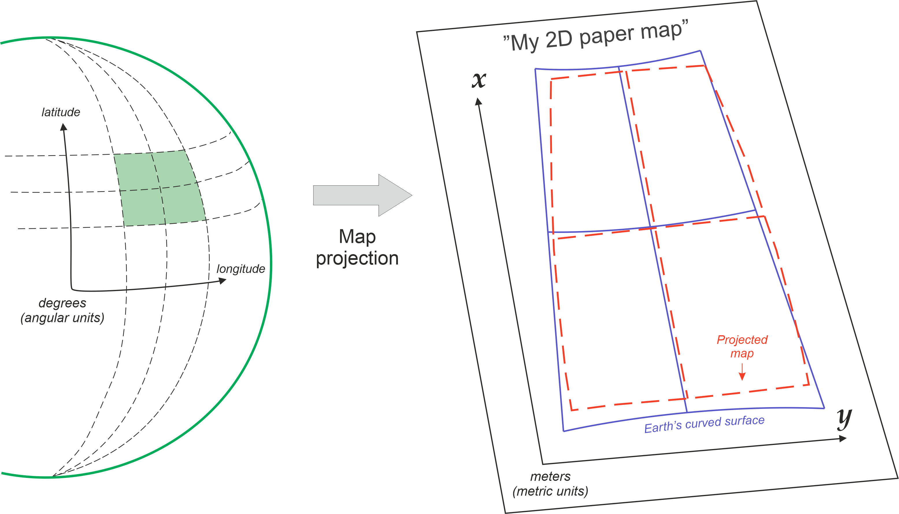
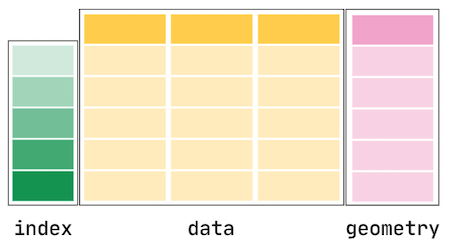

# TD 1 - Manipuler des données géographiques


## Préparation de l'environnement de développement

Dans le cadre de ce cours, nous allons utiliser différents outils de développement pour mettre en pratique les principales notions de la fouille de données spatiales. Ces outils sont [Python3](https://www.python.org/), [Anaconda](https://www.anaconda.com/) et [Jupyter Notebook](https://jupyter.org/). Nous utiliserons aussi différentes bibliothèques telles que [Gdal](https://gdal.org/index.html), [GeoPandas](https://geopandas.org/en/stable/), [rasterio](https://rasterio.readthedocs.io/en/stable/), ou [Scikit-learn](https://scikit-learn.org/stable/). 
Afin d'éviter d'avoir à installer ces différents outils sur votre machine, nous allons utiliser GitHub, et plus particulièrement les [GitHub Codespaces](https://github.com/features/codespaces) pour coder en ligne. 

Vous devez tout d'abord cloner le dépôt (_repo_ dans la terminologie git) `flouvat/codespaces-spatial-dm`. Il contient les données géographiques utilisées dans le cours et divers fichiers de configuration. Pour cela, il faut suivre les étapes suivantes:
- Dans votre espace GitHub, recherchez le dépôt  `flouvat/codespaces-spatial-dm` et ouvrez-le.
- Pour le cloner dans votre compte, il suffit de cliquer sur le bouton `Fork` et de valider les paramètres en cliquant sur le bouton `Create fork`.


L'environnement de développement en ligne de GitHub s'appelle [Codespaces](https://docs.github.com/fr/codespaces). Pour l'utiliser, il vous suffit de cliquer sur le bouton `<> Code`, puis de sélectionner l'onglet `Codespaces` et de créer un codespace sur le main. L’initialisation du codespace prend un peu de temps car elle installe certaines bibliothèques Python (p.ex. `matplotlib`, `numpy` et `pandas`).  
Un nouvel onglet s'ouvrira alors, et vous pourrez commencez à configurer votre environnement permettant de traiter des données géographiques.


Dans le terminal de Codespace, vous devez ensuite installer toutes les bibliothèques nécessaires en utilisant la commande `conda env create -f environment.yml`. Elle permet de créer un environnement virtuel, appelé `geopy`, avec les librairies nécessaires installées. Si la commande n'est pas reconnue, ouvrez un autre terminal (menu déroulant  ) et relancez la. La procédure prend un peu de temps (5 minutes environ). Attention, il faudra donc ensuite utiliser cet environnement lorsque vous exécuterez votre code dans Jupyter Notebook. 

Pour tester votre installation, vous pouvez aller dans le répertoire `\jupyter`, ouvrir le fichier `test.ipynb`, et exécuter le code Python inclut à l'intérieur. Si vous l’exécutez sans utiliser l'environnement virtuel `geopy`, vous obtiendrez une erreur `ModuleNotFound` car les bibliothèques utilisées dans le code ne sont pas accessibles. Pour utiliser `geopy`, il vous faut utiliser le bon "noyau Python" pour lancer le code. Ce noyau peut être sélectionné en cliquant sur le bouton  , puis en cliquant `Environnements Python` > `geopy`. Le code vous affichera alors un simple avertissement concernant `ResamplingOperation`. Une fois cela fait, vous pouvez exécuter le code de test.

## Les principaux types des données géographiques
Les données spatiales (ou données "géospatiales" ou encore "géographiques") sont des données contenant des informations de localisation.

Ces données  se présentent principalement sous deux formes :
- les données vectorielles 
- les données `raster`

### Les données vectorielles

Les données vectorielles s'attachent à représenter des formes (des objets géométriques) et à les positionner dans un système de coordonnées. Elles correspondent donc simplement à une collection de coordonnées à deux dimensions `(x,y)` ou a trois dimensions `(x,y,z)`, appelées "sommets". Ces sommets sont utilisés pour définir les objets suivants :
- `Point` : un seul point (p.ex. l'emplacement d'une personne)
- `Ligne` : deux ou plusieurs points connectés (p.ex. une route)
- `Polygone` : trois points ou plus connectés et fermés (p.ex. un bâtiment,  un lac ou la frontière d'un pays)


Comme illustré ci-dessous, ces objets peuvent être combinées pour aboutir à des données plus complexes telles que des `multi-points`, `multi-lignes`, `multi-polygones` ou `collections géométriques`.


### Les données rasters

Contrairement aux données vectorielles, les données raster correspondent à une matrice de valeurs de `pixels` (également appelées "cells"). Chaque pixel représente une petite zone et contient une valeur numérique.


Les données raster sont des images pour lesquelles chaque pixel représente une région spatiale. On parle de `résolution d’un raster` pour expliciter les dimensions de la zone (un carré) représenté par chaque pixel de l'image. Un raster de résolution de 1 mètre signifie que chaque pixel représente une zone de 1 m x 1 m au sol. On parle de "haute résolution" lorsque la valeur associée à la résolution est faible. Per exemple, une résolution de 1 mètre est supérieure à une résolution de 8 mètres, comme l'illustre l'image ci-dessous.


Les données raster sont utilisées dans différents contexte. Par exemple, les images satellitaires sont des raster, tout comme les Modèle Numérique de Terrain (MNT, i.e. Digital Elevation Model ou DEM en anglais). Les données raster peuvent issues de télédétection ("remote sensing"), i.e. d’instruments permettant d’acquérir à distance des informations sur un objet géographique. Typiquement, ces rasters sont capturés par des satellites, des avions ou des drones. 

Comme expliqué dans la documentation de [ArcGIS](https://pro.arcgis.com/fr/pro-app/latest/help/data/imagery/raster-bands-pro-.htm), certaines de ces images peuvent être composées d'une bande ou couche (i.e. mesurer une seule caractéristique), alors que d'autres peuvent être composées de plusieurs bandes (i.e. mesurer plusieurs caractéristiques). On parle alors d'`images multi-bandes`. Dans ce cas, chaque pixel est associé à plusieurs valeurs (autant que de bandes). Chaque bande correspond ainsi à une matrice de valeurs. Une bande représente une partie du spectre électromagnétique détecté par un capteur (p.ex. rouge, vert, bleu, proche infrarouge ou ultraviolet). Par exemple, les images Landsat-9 comportent 11 bandes différentes.


Le nombre et le type de bandes capturées par les différents capteurs peuvent beaucoup varier. Ces informations sont importantes, et déterminent souvent le choix du capteur (p.ex. du satellite d'acquisition). En effet, car certaines bandes sont plus adaptées pour observer certains types d'objets (p.ex. le proche infra-rouge pour la végétation ou l'ultraviolet pour les objets sous la surface de l'eau). D'ailleurs, les géomaticiens ont définis un grand nombre d'indices basés sur une combinaison de bandes afin de mieux identifier et quantifier certains objets. Un exemple classique est le NDVI ("Normalized Difference Vegetative Index") pour étudier la couverture végétale. La  [base de données IDB](https://www.indexdatabase.de/) ("Index DataBase") recense les différents capteurs existants, leurs caractéristiques et les indices calculables à partir de ceux-ci.


### Les systèmes de coordonnées de référence (CRS)

Un `système de référence de coordonnées` (CRS) est un élément clé de l'information géographique. Un CRS précise comment les coordonnées ou les géométries sont liées aux lieux sur Terre. Sans le CRS, les données géographiques sont simplement une collection de coordonnées dans un espace arbitraire. Cette information appartient aux `métadonnées`, tout comme l'horodatage de création des données.

Un CRS est composé de trois éléments:
- le `datum`  est un modèle de la taille et de la forme de la Terre (p.ex. ellipsoïde ou géoïde). Il indique aussi l'origine du système de coordonnées et son orientation par rapport à la surface de la terre. L'un des systèmes de référence les plus couramment utilisés est le système géodésique mondial (WGS84).
- la `projection cartographique` définit la transformation mathématique utilisée pour projeter la surface de la Terre sur un plan bidimensionnel. 
- des paramètres supplémentaires telles que le méridien central, le parallèle standard et le facteur d'échelle.



La projection cartographique est une transformation particulièrement complexe qui engendre des [approximations](https://www.axismaps.com/guide/map-projections). Par conséquent, une projection doit être choisie en fonction du but d'utilisation, afin de préserver les aspects spécifiques de la carte qui sont les plus importants pour l'utilisateur, comme par exemple :
- la projection `Mercator` pour préserver les angles (donc les formes) ;
- les projections `Mollweide` ou `Albers equal area` pour préserver les surfaces ;
- la projection `Azimuthal equidistant` pour préserver les distances au centre de la projection.


**A noter qu'à une échelle petite (locale) ces distorsions restent minimes.**

## Manipuler des données vectorielles en Python


Les données vectorielles sont classiquement stockée dans différents types de fichiers tels que:
- des fichiers textes (p.ex. CSV)
- des fichiers `shapefiles`
- des fichiers `geojson`
- des fichiers `KML`

Ces fichiers peuvent être lus en Python grâce à des bibliothèques telles que [Shapely](https://shapely.readthedocs.io/en/latest/) ou [GeoPandas](https://geopandas.org/en/stable/). Ils permettent de générer des objets géométriques Python, qui peuvent ensuite être traités, fusionnés avec d'autres données, et analysés. Il existe de nombreuses fonctionnalités utiles que vous pouvez par exemple utiliser telles que :
- Créer une ligne ou un polygone à partir d'une collection de `Point`
- Calculer les surfaces/longueurs/limites, etc. 
- Effectuer des opérations géométriques telles que l'union, la différence, la distance, etc. 
- Effectuer des requêtes spatiales entre les objets telles que l'intersection, l'inclusion, la tangence, le croisement, etc. 


### Représenter des objets géométriques avec Shapely

Comme illustré dans les figures précédentes, les objets géométriques les plus fondamentaux dans `Shapely` sont `Point`, `LineString` et `Polygon`. 

#### Créer et manipuler des points

Créer un objet `Point` est très simple. Il suffit de passer en paramètre du constructeur les coordonnées `x` et `y` de l'objet (et éventuellement la coordonnée `z`). Vous pouvez par exemple tester le code suivant dans votre interface `Jupyter Notebook` sur `Codespace`. Pour cela, vous allez créer un nouveau fichier `readVectorData.ipynb` dans le répertoire `\jupyter`.
*Pensez à réutiliser toujours le même Codespace (vous pouvez même le nommer) avec l'environnement `geopy` afin d'éviter de devoir tout réinstaller à chaque fois.*

```python
# Import necessary geometric objects from shapely module
from shapely.geometry import Point, LineString, Polygon

# Create Point geometric object(s) with coordinates
point1 = Point(2.2, 4.2)
point2 = Point(7.2, -25.1)
point3 = Point(9.26, -2.456)

point3D = Point(9.26, -2.456, 0.57)

# What is the type of the point?
point_type = type(point1)

# Print point information
print(point1)

print(point3D)

print(type(point1))
```

La classe `Point` contient un certain nombre de méthodes et attributs permettant par exemple d'accéder aux coordonnées (attribut `coords`), à son abscisse (attribut `x`), à son ordonnée (attribut `y`) ou de calculer une distance à un autre point (méthode `distance(Point)`). A noter que le type de `coords` est `CoordinateSequence` et non un tableau de valeur. Pour obtenir ce tableau avec les coordonnées, il faut passer par l'attribut `xy` de `CoordinateSequence`, qui est un tableau `numpy` de nombres réels double précision (`double`). Le code suivant illustre cela. Pour le tester, il vous faut ajoute rune cellule de code  dans votre fichier `readVectorData.ipynb`,  copier le texte suivant et l'exécuter.

```python
# Get only x coordinates of Point1
x = point1.x
print(x)

# Get only y coordinates of Point1
y = point1.y
print(y)

# Get x and y coordinates
point_coords = point1.coords
print(type(point_coords))

xy = point_coords.xy
print(xy)
```

#### Créer et manipuler des lignes

La création d'un objet `LineString` est assez similaire à la façon dont un objet `Point` est créé. Toutefois, au lieu d'utiliser une seule coordonnée, nous allons utiliser une liste de coordonnées ou une liste de `Point`, comme le montre le code suivant. Tout comme précédemment, cette classe contient des attributs et méthodes pour accéder à différentes informations de l'objet, comme ses coordonnées (attribut `xy`), sa longueur (attribut `length`), son centroïde (attribut `centroid`). Le code suivant illustre cela. Vous pouvez le tester dans un nouveau bloque de code de `readVectorData.ipynb`.

```python
# Create a LineString from our Point objects
line = LineString([point1, point2, point3])
print(line)
print( type(line) )

# It is also possible to use coordinate tuples having the same outcome
line2 = LineString([(2.2, 4.2), (7.2, -25.1), (9.26, -2.456)])
print(line2)

# Get x and y coordinates of the line (an array of array of double, where line.xy[0] correspond to abscisses and line.xy[0] to ordinates)
lxy = line.xy
print(lxy)

# Extract x coordinates
line_x = lxy[0]
print(line_x)

# Extract y coordinates 
line_y = line.xy[1]
print(line_y)

# Get the length of the line
l_length = line.length
print("Length of our line: {0:.2f}".format(l_length))

# Get the centroid of the line
l_centroid = line.centroid
print("Centroid of our line: ", l_centroid)

# What type is the centroid? A point
centroid_type = type(l_centroid)
print("Type of the centroid:", centroid_type)
```

#### Créer et manipuler des polygones

La création d'un objet `Polygon` poursuit la même logique que celle des `Point` et `LineString`. Le polygone a néanmoins besoin d'au moins trois tuples de coordonnées (ou trois points). A noter aussi que les coordonnées d'un polygone sont entourées de deux parenthèses (p.ex. `POLYGON ((2.2 4.2, 7.2 -25.1, 9.26 -2.456, 2.2 4.2))`) car il est possible aussi d'avoir des trous dans les polygones. Tout comme précédemment, nous pouvons accéder à différents attributs du polygone tels que la surface, le centroïde, son enveloppe ("minimal bounding box), son contour, son périmètre etc.


```python
# Create a Polygon from the coordinates
poly = Polygon([(2.2, 4.2), (7.2, -25.1), (9.26, -2.456)])
print(poly)
print( type(poly) )

# Create a Polygon from the points
poly2 = Polygon([point1, point2, point3])
print(poly2)

# We can also use our previously created Point objects (same outcome)
# --> notice that Polygon object requires x,y coordinates as input
poly3 = Polygon([[p.x, p.y] for p in [point1, point2, point3]])
print(poly3)

# Get the centroid of the Polygon
poly_centroid = poly.centroid
print("Poly centroid: ", poly)

# Get the area of the Polygon
poly_area = poly.area
print("Poly Area: ",poly_area)

# Get the bounds of the Polygon (i.e. bounding box)
poly_bbox = poly.bounds
print("Poly Bounding Box: ",poly)

# Get the exterior of the Polygon
poly_ext = poly.exterior
print("Poly Exterior: ", poly_ext)

# Get the length of the exterior
poly_ext_length = poly_ext.length
print("Poly Exterior Length: ", poly_ext_length)
```

#### Créer et manipuler des collections d'objets géométriques

`Shapely` permet aussi de représenter simplement des collections de `Point`, `LineString` ou `Polygon`. Ces classes spécifiques, ayant le préfixe `Multi`, sont `MultiPoint`, `MultiLineString` et `MultiPolygon`. Elles prennent en paramètre une liste d'objets. Le code suivant illustre leur utilisation.

```python
from shapely.geometry import MultiPoint, MultiLineString, MultiPolygon

# Create a collection of two points
multipoint = MultiPoint([Point(2, 2), Point(3, 3)])
print(multipoint)

# Create a collection of two lines
multiline = MultiLineString(
    [LineString([(2, 2), (3, 3)]), LineString([(4, 3), (6, 4)])]
)
print(multiline)

# Create a collection of two polygons
multipoly = MultiPolygon(
    [Polygon([(0, 0), (0, 4), (4, 4)]), Polygon([(6, 6), (6, 12), (12, 12)])]
)
print(multipoly)
```

Ces classes contiennent un certain nombre d'attributs très pratiques permettant d'avoir des informations sur l'ensemble de la collection telles que l'enveloppe convexe (attribut `convex_hull`) ou la surface totale (attribut `area`). Il est aussi possible de vérifier "la validité" des polygones (attribut `valid`), i.e. vérifier que les polygones soient tous disjoints.

```python
# Convex Hull of our MultiPoint --> https://en.wikipedia.org/wiki/Convex_hull
convex = multipoint.convex_hull
print("Convex hull of the points: ", convex)

# Let's calculate the area of our MultiPolygon
multi_poly_area = multipoly.area
print("Area of our MultiPolygon:", multi_poly_area)

# We can check if we have a "valid" MultiPolygon. MultiPolygon is thought as valid if the individual polygons does not intersect with each other. This can be really useful information when trying to find topological errors from your data
valid = multipoly.is_valid
print("Is polygon valid?: ", valid)
```

Par ailleurs, ces objets se parcourent comme n'importe qu'elle liste Python avec l'opérateur `[]`.

```python
west_area = multipoly[0].area
```

### Manipuler des données SIG avec GeoPandas

La bibliothèque [GeoPandas](https://geopandas.org/en/stable/index.html) est un des principaux outils de traitement de données spatiales. Elle supporte les principaux formats de fichiers SIG et permet d'effectuer simplement des opérations géospatiales.


#### GeoPandas

Cette bibliothèque est construite à partir de [Shapely](https://shapely.readthedocs.io/en/stable/manual.html) et [Pandas](https://pandas.pydata.org/). Pandas est une boîte à outils d'analyse de données facile à utiliser mais puissante. Il s’agit d’un framework d’analyse de données largement utilisé dans différents domaines scientifiques. Pandas s'appuie sur plusieurs autres bibliothèques en arrière-plan telles que `NumPy`, `matplotlib` et `SciPy`. L'une des fonctionnalités les plus utiles de Pandas est sa capacité à interagir avec de nombreux formats de données. Elle offre aussi deux structure de données ([DataFrame](https://pandas.pydata.org/docs/reference/api/pandas.DataFrame.html) et `Series`) permettant de manipuler efficacement des données.


Tout comme Pandas, GeoPandas fournit deux classes clés pour la manipulation des données spatiales :
- `GeoSeries` (issu de la classe Series de Pandas) stocke des séquences d'objets géométriques comme des points, des lignes, des polygones
- `GeoDataFrame` (issu de la classe DataFrame de Pandas) stocke des données sous forme de feuilles de calculs ayant au moins une colonne géométrique (une GeoSeries).




#### Lire et écrire des données vectorielles avec GeoPandas

La lecture de données dans Python est généralement la première étape d'un processus d'analyse de données. Il existe différents formats de données SIG, tels que [Shapefile](https://en-m-wikipedia-org.translate.goog/wiki/Shapefile?_x_tr_sl=en&_x_tr_tl=fr&_x_tr_hl=fr&_x_tr_pto=wapp) , [GeoJSON](https://en-m-wikipedia-org.translate.goog/wiki/GeoJSON?_x_tr_sl=en&_x_tr_tl=fr&_x_tr_hl=fr&_x_tr_pto=wapp), [KML](https://en-m-wikipedia-org.translate.goog/wiki/Keyhole_Markup_Language?_x_tr_sl=en&_x_tr_tl=fr&_x_tr_hl=fr&_x_tr_pto=wapp) et [GeoPackage](https://en-m-wikipedia-org.translate.goog/wiki/GeoPackage?_x_tr_sl=en&_x_tr_tl=fr&_x_tr_hl=fr&_x_tr_pto=wapp). GeoPandas permet de lire tous ces formats et beaucoup d'autres (DXF, CSV, OpenFileGDB, ESRIJSON, FlatGeobuf, GeoJSONSeq, GPKG, GML, OGR_GMT, GPX, Idrisi, MapInfo File, DGN, PCIDSK, OGR_PDS,
S57, SQLite, TopoJSON).

L'un des formats les plus utilisés pour stocker des données vectorielles est le format `shapefile`. Il a été introduit par [ESRI](https://www.esrifrance.fr/), un des leaders des Systèmes d’Information Géographique (SIG), dans les années 90. Il est devenu depuis l'un des standards en la matière. Nous allons donc tout d'abord lire ce type de fichier.

Un `shapefile` est composé de 3 fichiers obligatoires avec le même préfixe, comme par exemple "spatial-data", mais des extensions différentes :
- spatial-data.shp: fichier principal qui stocke les informations de chaque forme géométrique
- spatial-data.shx: index de la manière dont les géométries du fichier principal sont liées les unes aux autres
- spatial-data.dbf: attributs de chaque enregistrement


 Chaque `shapefile` ne peut contenir qu'un seul type de forme. Par exemple, les descriptions d'une maison (point), d'une route (ligne) et  d'une ville (polygone) seraient stockées dans trois shapefiles distincts.


#### Manipuler des données vectorielles avec GeoPandas


#### Quelques traitements basiques avec les données vectorielles

les unité pour les longueurs distance  -> simple disatnce encliudienne(https://shapely.readthedocs.io/en/stable/manual.html#coordinate-systems) 

distance : https://kodu.ut.ee/~kmoch/geopython2021/L1/Geometric-Objects.html#side-note-on-distances-in-gis


#### Exercice

https://pythongis.org/part2/chapter-06/nb/01-introduction-to-geopandas.html


## Manipuler des rasters

https://pythongis.org/part2/chapter-05/nb/01-introduction-to-geographic-data-in-python.html#


Comme pour les données vectorielles, il existe différents formats de fichiers pour stocker les données raster. Le plus courant est `GeoTIFF` ( .tif), qui est essentiellement un fichier image contenant des métadonnées de géoréférencement. Le package de base pour travailler avec des données raster en Python est rasterio .

