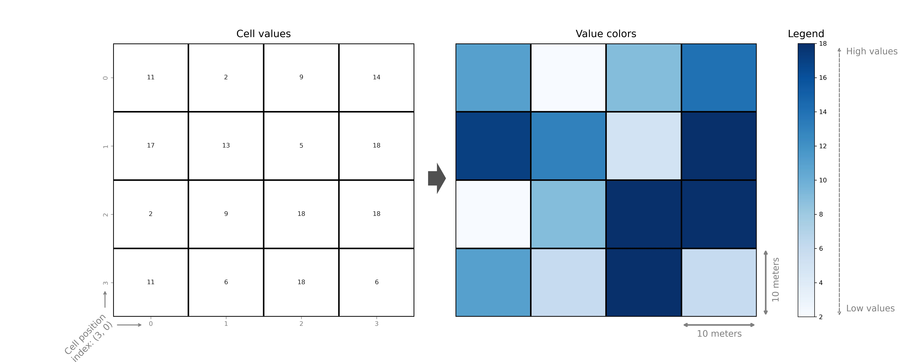
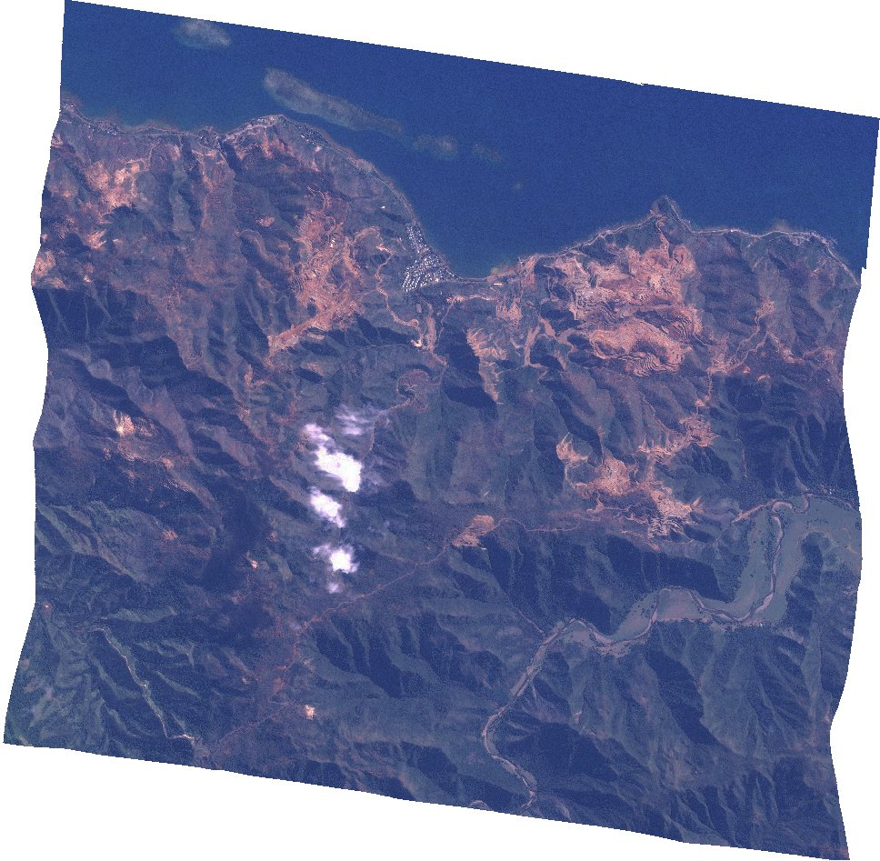
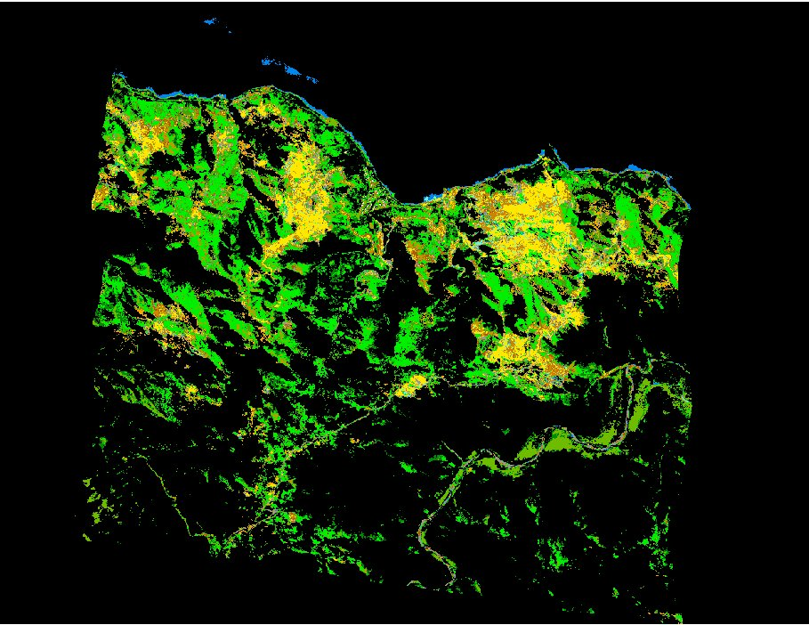
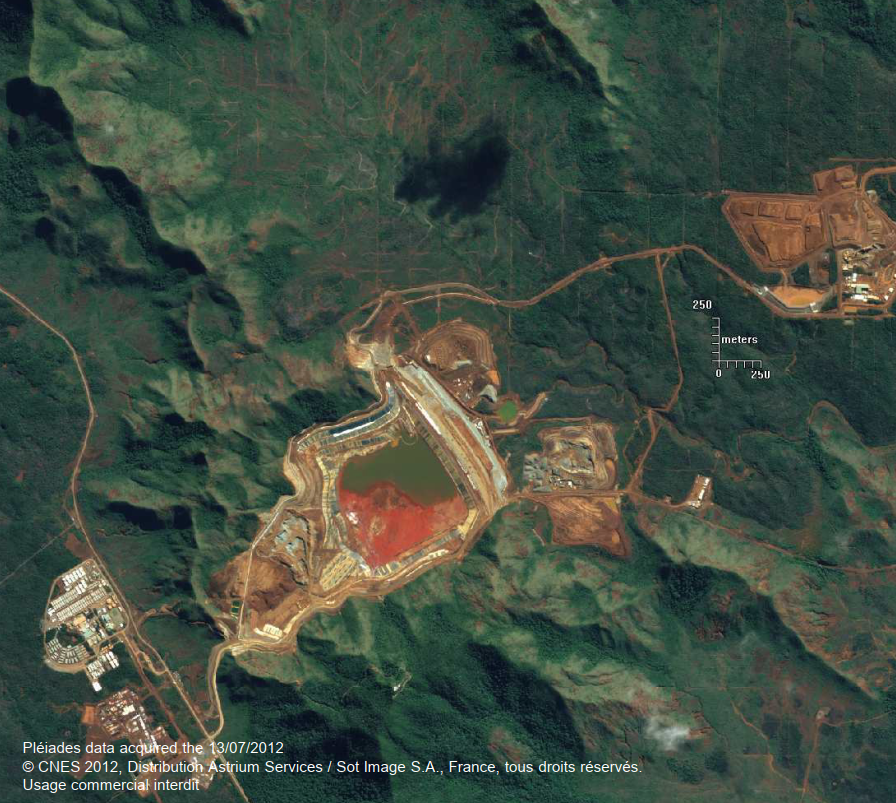

Comme nous l'avons vu précédemment, les objets géographiques peuvent être principalement représentées sous deux formes : `vectorielles` ou `raster`. Dans le modèle de données raster, les données sont représentées sous forme de `matrices de valeurs`, de `grilles de "pixels"`.  La grille est associée à un emplacement géographique spécifique et chaque cellule de la grille contient une valeur représentant certaines informations, telles que une information spectrale, une altitude, une température ou la présence/absence d'un objet. 

Cette représentation est couramment utilisée pour représenter des images satellite, des modèles numériques d'élévation, et d'autres types de données ayant une `grande étendue spatiale` (couvrant par exemple des pays entiers, des continents ou le monde) et des `mesures continues dans tout l'espace`.  Il est également possible de stocker des données discrètes ou catégorielles dans un raster, telles que des données de classification de l'occupation des sols. Les données raster sont couramment utilisées, par exemple, pour la surveillance environnementale, la météorologie et la cartographie. Les deux raster ci-dessous représentent une image prise par le satellite [RapidEye](https://earth.esa.int/eogateway/missions/rapideye) en 2008 et le résultat d'une classification des pixels de cette même image par rapport à la végétation.

 La `résolution spatiale` d'un raster, i.e. la taille de la zone représentées par un pixel, est un aspect important de ce type de données. En effet, la résolution spatiale détermine avec quelle précision les entités du monde réel, telles que les bâtiments ou les éléments topographiques, peuvent être représentées ou identifiées à partir des données. Les autres caractéristiques importantes d'un raster sont sa `profondeur de bit` (la plage des valeurs de pixels) et son `nombre de bandes` (le nombre de couches, i.e. le nombre de valeurs associées à chaque pixel).

Il existe de nombreux formats de fichiers pour stocker les données raster. Le plus courant est `GeoTIFF` ( .tif), qui est essentiellement un fichier image contenant des métadonnées de géoréférencement. Le package de base pour travailler avec des données raster en Python est [Rasterio](https://rasterio.readthedocs.io/en/latest/) .

# Lire des données raster avec Rasterio

`Rasterio` est une bibliothèque Python permettant de lire et écrire plusieurs formats raster différents. `Rasterio` est basé sur [GDAL](https://gdal.org/) et supporte donc tous les pilotes `GDAL` lorsque la bibliothèque est importée. `GDAL` est une des principales bibliothèques permettant de traiter de l'information géographique. Elle est principalement écrite en C/C++ et est utilisée dans un grand nombre de logiciels (p.ex. ArcGIS, ENVI, QGIS, Google Earth ou Orfeo Toolbox). 

